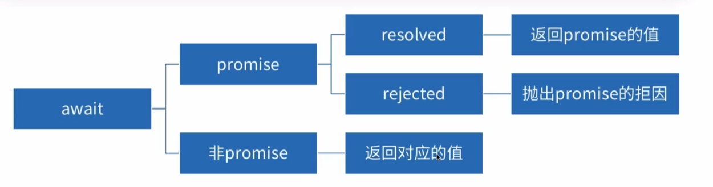

# 深入理解 async/await

## 什么是

- 是一个语法糖，让异步操作更加简单
- 返回值是一个 promise
  - return 的值是 promise resolved 时候的 value
  - throw 的值是 promise rejected 时候的 reason

## 认识 async

```js
async function test() {
  return 1
}
const p = test()
console.log(p)
p.then(function (data) {
  console.log(data)
})
```

## await

- 只能出现在 async 函数内或者最外层
- 等待一个 promise 对象的值
- await 的 promise 状态为 rejected，后续操作中断
  

## 错误捕获

以下代码 reject 后，后续代码中断

```js
async function f() {
  await Promise.reject('error')
  console.log(1) // 后续代码不会执行
  return 100
}
f()
```

当使用 catch 捕获错误后，后续代码不会中断

```js
async function f() {
  await Promise.reject('error').catch(err => {
    // 处理异常
  })
  console.log(1) // 执行
  return 100
}
f()
```

使用 trycatch 也不会中断

```js
async function f() {
  try {
    await Promise.reject('error')
  } catch (e) {
    // 处理异常
  }
  console.log(1) // 执行
  return 100
}
f()
```

## async 函数实现原理

底层使用了 generator 生成器作为封装实现
async function example(params) {
...
}为例
@[code](./example.js)
