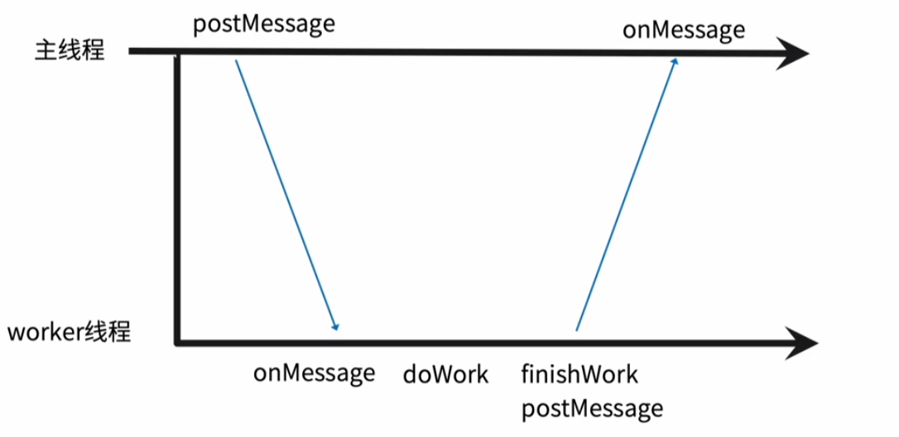

# web workers

- 一个 webAPI=> 浏览器能力=>提供一个 js 可以运行的环境
- web 应用可以独立于主线程的后台线程中，运行一个脚本操作
- 提升性能

## 数据通信

使用 postMessage 和 onMessage 来完成通信

## 使用场景

- js 执行复杂运算阻塞页面渲染
- 复杂运算
- 渲染优化 （canvas）
- 流媒体数据处理 flv.js
## 限制

- 同源限制
- 与主线程的上下文不同(无法操作 dom)
- 不能读取本地文件
- 嵌入式 worker
  

## webworkify
