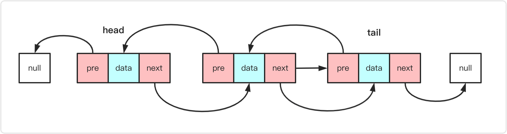

# 双向链表(DoublyLinkedList)

## 认识双向链表

### 优点

- 既可以从头遍历，又可以从尾部遍历
- 链表相连是双向的
- 既有向前引用，又有向后引用

### 缺点

- 每次插入或者删除节点，需要处理四个引用
- 相比单项链表，更占内存

## 常见的方法

- append(element) 尾部添加项
- insert(position,element) 特定的位置添加项
- get(position) 获取对应位置的元素
- indexOf(element) 返回元素在列表的索引，没有返回-1
- update(position,element) 修改某个位置的元素
- removeAt(position) 移除特定位置元素
- remove(element) 移除一项
- isEmpty() 判断链表是否为空
- size() 返回链表的大小
- toString() 返回链表内容
- forwardString() 返回向前遍历的节点字符串形式
- backwardString()返回向后遍历的节点字

## 封装

@[code](./DoublyLinkedList.js)
