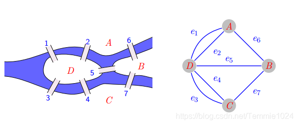

# 图论(Graph)

## 什么是图

:::tip 现实案例

- 人与人之间的关系网：六度空间理论
- 地铁路线图
- 村庄图

:::

- 图结构是一种和树结构有些相似的数据结构
- 图论是数学的一个分支，在数学的概念上，树也是图的一种
- 他以图为研究对象，研究顶点和边组成的图形数学理论和方法
- 主要研究的目的是事物之间的关系，顶点代表事物，边代表两个事物间的关系

## 图结构特点

- 一组顶点：用 V（vertex）表示
- 一组边：用 E（edge）表示
  > 边是顶点和顶点之间的连线  
  > 边可以是有向的，也可以是无向的  
  > A --- B 无项  
  > A --> B 有项

## 常用术语

- 顶点 V：图中的节点
- 边 E：顶点和顶点连线
- 相邻顶点：由一条边连接起来的顶点
- 度：一个顶点相邻顶点的个数
- 路径
  - 简单路径：一条路径里不能包含重复顶点
  - 回路：从顶点出发回到同个顶点的路径
- 无项图：边没有方向
- 有项图：边有方向
- 无权图：边没有携带权重
- 带权图：边存在权重

## 邻边矩阵

- 让每一个节点和一个整数关联，该整数作为数组的下标值
- 我们用一个二维数组来表示顶点之间的连接
- [0][2] -> a->c

:::danger 缺点
如果图是一个稀疏图，那么矩阵中存在大量的 0，这会浪费存储空间来表示不存在的边
:::

## 邻接表

- 由每个顶点和顶点相邻的顶点列表组成
- 使用数组，链表，字典来存储列表
## 图的遍历
### 广度优先搜索
BFS（breadth-first-search）,基于队列，入队列的顶点先被探索  
+ 创建一个队列
### 深度优先搜索
DFS（depth-first-search）  
+ 以深度作为优先
+ 基于栈或使用递归，将栈顶存入栈中，顶点沿着路径被探索的，存在新的相邻顶点就去访问
### 状态
为了记录顶点被访问过，需要使用三个颜色来反应状态
+ 白色：表示该顶点没有被访问
+ 灰色：表示该顶点被访问过，但是没有探索
+ 黑色：表示被访问过且已经被完全探索过
## 封装
@[code](./Graph.js)