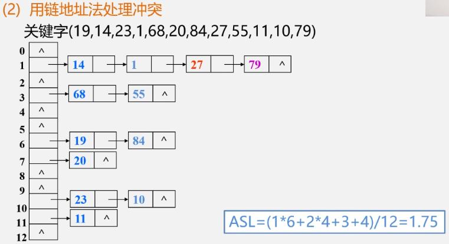
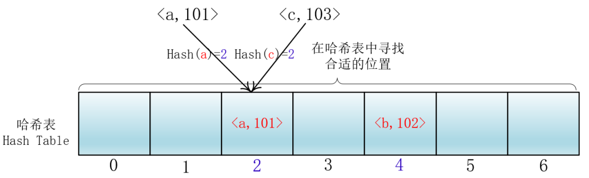

# 哈希表(HashTable)

## 认识哈希表

哈希表是一种重要的数据结构，基于数组实现，但是相对于数组，存在很多优势

- 可以快速插入，删除，查找操作
- 无论什么数据，插入和删除接近常量时间，
- 速度比**树还要快**
- 相对于树编码容易
- 结构就是数组，但是可以对下标值进行转换，这个转换称之为**哈希函数**，通过 hash 函数可以获取到**HashCode**

:::danger 缺点

- 哈希表的数据是没有顺序的，所以不能一个固定的方式拍下
- 通常情况，哈希表的 key 不能重复

:::

## 哈希表的概念

- 哈希函数： 将一个**数据**转成**大数字**，**大数字**进行**哈希化**的实现称为哈希函数
- 哈希化：将一个**大数字**转化成**数组范围内下标**的过程称为**哈希化**
- 哈希表：将数据插入数组，对整个**结构的封装**称为**哈希表**

:::tip
哈希化以后的下标值可能会重复，那么如何解决

常见的方案

- 链地址法（拉链法）
- 开放地址法
  :::

## 链地址法

### 解析

- 从图中我们可以看出，链地址解决冲突的方法是每个数组单元存储的不再是单个数据，而是一个链条
- 链条可以使用什么数据结构呢，常见的是**数组和链表**
- 如果是链表，每个数组单元存储一个链表，一旦发现重复，将重复的元素插入链表的**首端**或者**末端**
- 在查询的时候，先根据哈希化后的下标查询对应位置，再取出链表，依次查找

### 数组还是链表

- 其实都可以，效率差不多
- 都是根据哈希化后的 index 找出这个数组或者链表的数据，都是线性查找
  > 某些实现，数组插入首位效率低，使用链表比较好
  > 如果是插入后端，数组和链表都差不多
- 最好采用链表，数组插入首位，所有元素都会后移动

## 开放地址法

### 解析

寻找空白的单元格来添加重复数据

探索这个空白的位置有三个方法

- 线性探测
  > 聚集问题：一连串的填充单元称为聚集。为了放一个重复元素，要跳过好多检测 22-23-24-25-26-27
  > 会影响性能
- 二次探测
  > 优化线性探测，主要实现是增加步长，探测距离从 1 ，2 的平方 ，3 的平方  
  > 问题：步长平方，步长固定，会产生另外一种形式的聚集。如 1，4，9，16
- 再哈希法
  > 用关键字使用另外的哈希函数再次哈希化
  > 让步长不固定

### 哈希函数

> stepSize = constant - (key % constant)  
> 其中 constant 是质数，，且小于数组容量  
> 例如 stepSize = 5 - (key % 5) 结果不会是 0

## 链地址法 VS 开放地址法

:::tip 填装因子

- 哈希表中已经**包含数据项**和**整个哈希表**的长度的比值
- 填装因子 = 总数据项 / 哈希表长度
- 如总数据是 5 哈希长度是 10 那么填装因子是 5 / 10 = 0.5
- 开放地址法的填装因子最大是 1，因为只有找到空白单元才能加入
- 链地址法填装因子可以大于 1，因为链表可以无限扩容，但是到后面效率会变低
  :::

哈希表执行插入和搜索操作效果非常高

- 如果没有产生冲突，效率更好
- 如果发生冲突，存取的时间依赖后来的探测长度
- 平均探测长度和平均存取时间，取决于**填装因子**，随着填装因子变大，探测长度也越来越大

## 哈希的方法

- 插入和修改操作 put(key,value)
- 获取方法 get(key)
- 删除 remove(key)
- 判空 isEmpty()
- 返回数据项 size()
- 修改表的容量 resize(limit)

## 哈希封装

@[code](./HashTable.js)

## 哈希扩容

### 为什么要扩容

如果所有的数据放在长度为 7 的数组中，数据量多了，每个 index 对应的 bucket 会越来越长，所以需要扩容  
如果删除元素的时候，容量为 10000，删除以后的数量是 1，那么造成容量太多，所以需要缩小容量

### 如何扩容

每次扩容，都要重新计算表,把之前的数据重新放在新的表中

### 判断是否是质数

@[code](./isPrime.js)
