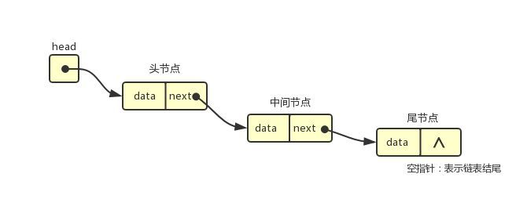

# 链表(LinkedList)

## 数组的缺点

- 大多数语言的数组创建需要申请一段连续的内存空间，并且大小是固定的，如果当前内存不满足容量需求，需要扩容(申请更大的数组，将数组中的元素复制到新的数组)
- 数组开头或者中间插入的成本很高，需要大量元素的位移

## 链表是什么

:::tip
链表也可以存储数据，链表中的元素在内存中不必是连续的，每一个元素存储着元素本身和指向下一个元素的引用（有些语言叫指针）
:::


相比数组的优点

- 内存不是连续的，可以充分利用计算机的内存，实现**内存动态管理**
- 链表不存在创建就确定大小，大小可以无线延伸下去
- 链表插入删除，**时间复杂度**可以达到 O(1),效率高

缺点

- 访问任何元素，都需要**从头访问**
- 无法通过下标直接访问元素，只能从头一个个访问

## 链表常见的方法

- append(element) 尾部添加项
- insert(position,element) 特定的位置添加项
- get(position) 获取对应位置的元素
- indexOf(element) 返回元素在列表的索引，没有返回-1
- update(position,element) 修改某个位置的元素
- removeAt(position) 移除特定位置元素
- remove(element) 移除一项
- isEmpty() 判断链表是否为空
- size() 返回链表的大小
- toString() 返回链表内容

## 单项链表封装

```js
function LinkedList() {
  // 节点类
  function Node(data) {
    this.data = data
    this.next = null
  }
  this.head = null
  this.length = 0
  // append(element) 尾部添加项
  LinkedList.prototype.append = function (data) {
    // 1.创建新节点
    var newNode = new Node(data)
    // 判断是否是第一个节点
    if (this.length === 0) {
      this.head = newNode
    } else {
      // 不是最后一个节点
      var current = this.head
      while (current.next) {
        // 找到最后一个节点
        current = current.next
      }
      // 这个时候的current是最后一个节点的next，且为空
      // 赋值为创建的节点
      current.next = newNode
    }
    this.length++
  }
  // insert(position,element) 特定的位置添加项
  LinkedList.prototype.insert = function (position, data) {
    // 边界判断
    if (position < 0 || position > this.length) return false
    var newNode = new Node(data)
    if (position === 0) {
      // 如果是0 插入首位
      newNode.next = this.head
      this.head = newNode
    } else {
      var index = 0
      var current = this.head
      var previous = null
      while (index++ < position) {
        // current赋值前的元素复制给previous
        previous = current
        current = current.next
      }
      newNode.next = current
      previous.next = newNode
    }
    this.length += 1
    return true
  }
  // get(position) 获取对应位置的元素
  LinkedList.prototype.get = function (position) {
    // 越界判断
    if (position < 0 || position >= this.length) return null
    // 获取信息
    var current = this.head
    var index = 0
    while (index++ < position) {
      current = current.next
    }
    return current.data
  }
  // indexOf(element) 返回元素在列表的索引，没有返回-1
  LinkedList.prototype.indexOf = function (data) {
    // 当前的值
    var current = this.head
    // 当前的下标
    var index = 0
    // 开始查找
    while (current) {
      if (current.data === data) {
        return index
      }
      current = current.next
      index++
    }
    return -1
  }
  // update(position,element) 修改某个位置的元素
  LinkedList.prototype.update = function (position, newData) {
    // 越界判断
    if (position < 0 || position >= this.length) return false
    var index = 0
    // 查找正确节点
    var current = this.head
    while (index++ < position) {
      current = current.next
    }
    current.data = newData
  }
  // removeAt(position) 移除特定位置元素
  // remove(element) 移除一项
  // isEmpty()
  // size()
  // toString()
  LinkedList.prototype.toString = function () {
    var current = this.head
    var listString = ''
    while (current) {
      listString += current.data
      current = current.next
    }
    return listString
  }
}
var list = new LinkedList()
// 测试append
list.append('a')
list.append('b')
list.append('c')
list.insert(0, 'aa')
list.insert(2, 'bb')
list.insert(5, 'cc')
alert(list.toString())
```
