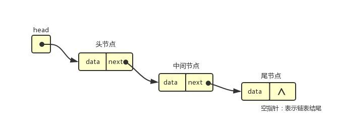

# 链表(LinkedList)

## 数组的缺点

- 大多数语言的数组创建需要申请一段连续的内存空间，并且大小是固定的，如果当前内存不满足容量需求，需要扩容(申请更大的数组，将数组中的元素复制到新的数组)
- 数组开头或者中间插入的成本很高，需要大量元素的位移

## 链表是什么

:::tip
链表也可以存储数据，链表中的元素在内存中不必是连续的，每一个元素存储着元素本身和指向下一个元素的引用（有些语言叫指针）
:::

相比数组的优点

- 内存不是连续的，可以充分利用计算机的内存，实现**内存动态管理**
- 链表不存在创建就确定大小，大小可以无线延伸下去
- 链表插入删除，**时间复杂度**可以达到 O(1),效率高

缺点

- 访问任何元素，都需要**从头访问**
- 无法通过下标直接访问元素，只能从头一个个访问

## 链表常见的方法

- append(element) 尾部添加项
- insert(position,element) 特定的位置添加项
- get(position) 获取对应位置的元素
- indexOf(element) 返回元素在列表的索引，没有返回-1
- update(position,element) 修改某个位置的元素
- removeAt(position) 移除特定位置元素
- remove(element) 移除一项
- isEmpty() 判断链表是否为空
- size() 返回链表的大小
- toString() 返回链表内容

## 单项链表封装
@[code](./LinkedList.js)