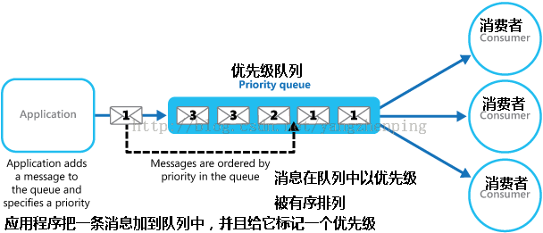

# 优先级队列（priority-queue）

## 介绍

:::tip
比较形象点，可以称为插队,比如优先给军人老人孕妇插队
:::
和队列差不多，但是优先级队列再插入元素的时候，会先考虑这个数据的优先级，和其他数据优先级**进行比较**，然后插入正确的位置

- 封装元素和优先级放在一起
- 添加元素，将新插入的元素的优先级和队列中存在元素的优先级比较，以获取正确的位置



## 封装

```js
function PriorityQueue() {
  // 子元素构造函数
  function QueueElement(element, priority) {
    this.element = element
    this.priority = priority
  }
  this.items = []
  // 插入方法
  PriorityQueue.prototype.enqueue = function (element, priority) {
    var queueElement = new QueueElement(element, priority)
    // 判断队列是否空
    if (this.items.length === 0) {
      this.items.push(queueElement)
    } else {
      var added = false
      for (var i = 0; i < this.items.length; i++) {
        // 如果优先级小于，添加到当前元素之前
        if (queueElement.priority < this.items[i].priority) {
          this.items.splice(i, 0, queueElement)
          added = true
          break
        }
      }
      // 没有找到优先级比自己高的，在尾部添加
      if (!added) {
        this.items.push(queueElement)
      }
    }
  }
}
```
