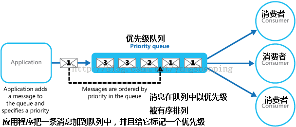

# 优先级队列（priority-queue）

## 介绍

:::tip
比较形象点，可以称为插队,比如优先给军人老人孕妇插队
:::
和队列差不多，但是优先级队列再插入元素的时候，会先考虑这个数据的优先级，和其他数据优先级**进行比较**，然后插入正确的位置

- 封装元素和优先级放在一起
- 添加元素，将新插入的元素的优先级和队列中存在元素的优先级比较，以获取正确的位置

## 封装

@[code](./PriorityQueue.js)
