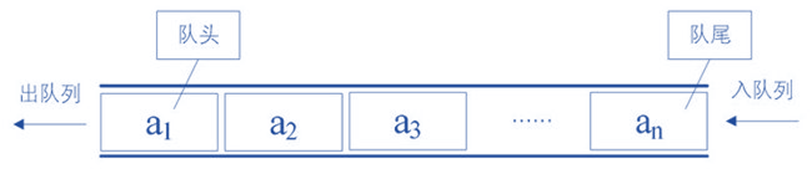

# 队列（Queue）

## 认识队列

这是一种受限的线性结构，和栈的先进后出相反，他是先进先出 FIFO

受限的地方

- 只能在表的前端进行删除操作
- 只能在后端进行插入操作



## 队列的应用

- 打印队列：
  - 有五份文档依次打印
  - 先放入的文档，先被打印，并优先取出
- 线程队列
  - 为了让任务并行工作，可能开启多线程
  - 但是不能让大量线程处理任务
  - 开启线程处理任务，我们使用线程队列
  - 按照次序来启动线程，并且处理对应任务

## 队列封装

```js
function Queue() {
  this.items = []
}
// 添加 enqueue
Queue.prototype.enqueue = function (element) {
  this.items.push(element)
}
// 删除 dequeue 返回删除的元素
Queue.prototype.dequeue = function () {
  return this.items.shift()
}
// 返回队列第一个元素 front
Queue.prototype.front = function () {
  return this.items[0]
}
// isEmpty 判断是否为空
Queue.prototype.isEmpty = function () {
  return this.items.length === 0
}
// size 返回队列长度
Queue.prototype.size = function () {
  return this.items.length
}
// toString
Queue.prototype.toString = function () {
  var result = ''
  for (var i = 0; i < this.items.length; i++) {
    result += this.items[i]
  }
  return result
}
```

## 队列击鼓传花

规则：

- 班上的人围成一圈，某个同学开始传花
- 班长击鼓，鼓声停下，花落在谁那里，谁表演节目

新规则

- 一群人围成一圈数数字，数到某个数字的人淘汰
- 下一个人继续从 0 开始数
- 剩下的人获胜，问最后剩下的在原来的什么位置

```js
function passGame(nameList, num) {
  // 创建一个队列结构
  var queue = new Queue()
  for (var i = 0; i < nameList.length; i++) {
    queue.enqueue(nameList[i])
  }
  while (queue.size() > 1) {
    // 开始数数字，如果是num 删除，不是，加入末尾
    for (var i = 0; i < num - 1; i++) {
      queue.enqueue(queue.dequeue())
    }
    // 淘汰
    queue.dequeue()
  }
  // 获取剩下的人下标
  if (queue.size() === 1) {
    return nameList.indexOf(queue.front())
  }
}
```
