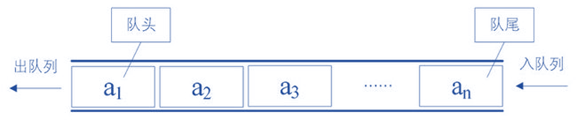

# 队列（Queue）

## 认识队列

这是一种受限的线性结构，和栈的先进后出相反，他是先进先出 FIFO

受限的地方

- 只能在表的前端进行删除操作
- 只能在后端进行插入操作

## 队列的应用

- 打印队列：
  - 有五份文档依次打印
  - 先放入的文档，先被打印，并优先取出
- 线程队列
  - 为了让任务并行工作，可能开启多线程
  - 但是不能让大量线程处理任务
  - 开启线程处理任务，我们使用线程队列
  - 按照次序来启动线程，并且处理对应任务

## 队列常见的方法

- enqueue(element) 添加元素
- dequeue() 删除元素并且返回该元素
- front() 返回队列的第一个元素
- isEmpty() 返回队列是否为空
- size() 返回队列的长度
- toString() 返回队列内容

## 队列封装

@[code](./Queue.js)

## 队列击鼓传花

规则：

- 班上的人围成一圈，某个同学开始传花
- 班长击鼓，鼓声停下，花落在谁那里，谁表演节目

新规则

- 一群人围成一圈数数字，数到某个数字的人淘汰
- 下一个人继续从 0 开始数
- 剩下的人获胜，问最后剩下的在原来的什么位置
  @[code](./passgame.js)
