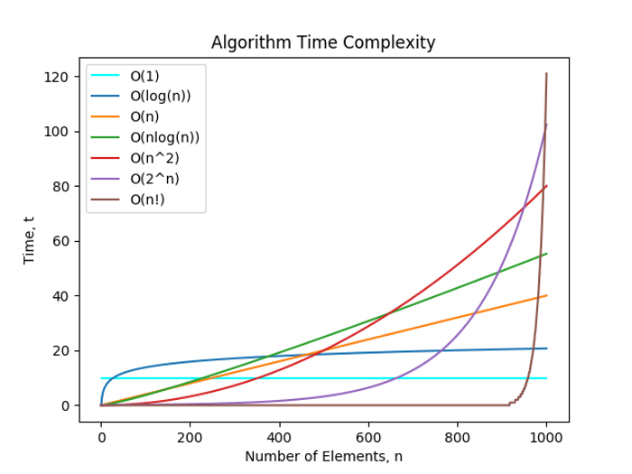

# 什么是数据结构和算法

## 什么是数据结构

计算机中，存储和组织数据的方式。精心选择的数据结构可以带来最优效率的算法

比如一个庞大的图书馆存放着大量的书籍，我们不仅仅要把书放进去，还应该在合适的时候拿出来

:::tip 一个问题？

- 一本图书摆放如何实现
  - 新书如何插入
  - 如何找到指定的书

:::

- 方法 1：随意排放
  - 哪里有空放哪里
  - 找本书累死人
- 方法 2：按照字母顺序排放
  - 新增加一本书《三国演义》按照字母插入
  - 二分法查找
- 方法 3：书架分类别，按照类别存放，类别安装字母排序
  - 先定类别，二分查找确定位置，移出空位
  - 先定类别，再二分查找

## 什么是算法（Algorithm）

- 算法定义
  - 一个有限的指令集，每条指令的描述不依赖语言
  - 接受一些输入（有些不需要输入）
  - 产生输出
  - 在有限的步骤后终止

通俗来讲算法就是解决问题的方法，步骤逻辑，数据的结构离不开算法

## 常见的数据结构

- 数组（Array）
- 栈（stack）
- 链表（Linked List）
- 图（Graph）
- 散列表（Hash）
- 队列（Queue）
- 树（Tree）
- 堆（Heap）

:::danger 注意
数据结构和语言无关，常见的编程语言都有**直接或者间接**的使用上述的常见数据结构
:::

常见的数据结构较多

- 每一种都有对应的场景，**不同的数据结构**和**不同的操作**性能是不一样的
- 有的查询性能快，有的插入性能快，有的插入头和尾部速度快
- 有的范围查找快，有的允许元素重复，有的不允许
- 开发中需要根据具体需求来选择

## 生活中的数据结构

除了图书摆放生活中还有好多例子

### 快递

- 快递放在固定的地方，大家自己去拿
- 到固定的地方拿快递，
  - 自己在海量的快递中查找
  * 快递员让你报出名字，他帮你找
- 自己查找相当于线性查找，一个个挨个查找
- 快递员查找，分类查找，在二分查找

### 找出电缆出问题的地方

假如上海到杭州有一条高架线，共 50 万米，其中有一米出现故障

- 一米米的排查，最坏要排查 50 万次
- 二分查找

## 大 O 表示法

### 什么是

- 在算法的描述中，我们也可以通过类似的快捷方式来描述计算机算法的效率
- 在计算机中，这种粗略的度量称为大 O 表示法
- 在算法比较重，我们更喜欢说算法 A 比算法 B 快 2 倍，但是这样比较没有意义
- 数据项个数发生变化的时候，算法的效率也会变化
- 所以我们使用一种算法的速度会如何跟随数据量变化的算法的方式来表示

### 常见的大 O 表示

| 符号       | 名称           |
| ---------- | -------------- |
| O(1)       | 常数           |
| O(log(n))  | 对数           |
| O(n)       | 线性           |
| O(nlog(n)) | 线性和对数乘积 |
| O(n²)      | 平方           |
| O(2ⁿ)      | 指数           |

### 推导表示法
+ 用常量1取代运行时间中所有的加法常量
+ 在修改后的运行次数函数中，保留最高阶项
+ 如果最高存在且不为1，取出与这个项相乘的常数