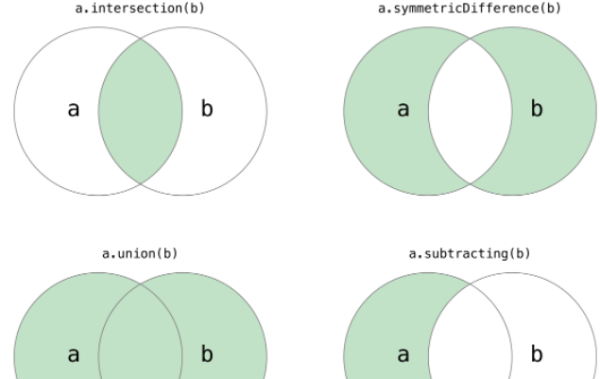

# 集合(Set)

## 认识集合

几乎每种编程语言都有集合的结构，比较常见的方式是**哈希表**

- 集合是无序的，不能重复的元素构成
- 他是特殊的数组，和普通数组不一样的地方，没有顺序，不能重复
- 不能使用下表访问

## 集合的方法

- add(value) 向集合添加新的项
- remove(value) 从集合移除一个值
- has(value) 判断值是否存在集合中
- clear() 移除集合中的所有项
- size() 返回集合的长度
- values() 返回集合所有值的数组

## 集合间的操作

- 并集 给两个集合，返回包含两个集合的元素的新集合
  A∪B = C
- 交集 给两个集合，返回两个集合中共有的新集合
  {1,2,3}∩{2,3,4}={2,3}
- 差集 两个集合，返回一个包含第一个集合，不存在第二个集合的新集合
- 子集 验证一个集合是否是另一个集合的内部子集

## 封装

:::tip
简易封装，不能添加复杂类型数据，正常应该使用 ES6 中的原生 set
:::
@[code](./Set.js)
