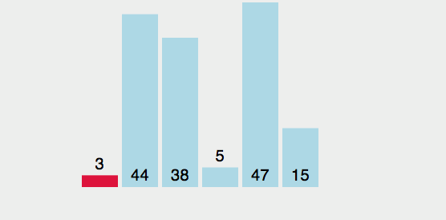

# 排序算法

- 排序算法有很多：冒泡排序/选择排序/插入排序/归并排序/计数排序/基数排序/希尔排序/堆排序/桶排序
- 简单排序：冒泡排序，选择排序，插入排序
- 高级排序：希尔排序，快速排序

## 冒泡排序

1. 对未排序的各元素从头到尾依次比较相邻的两个元素的大小关系
2. 如果左边大，两个交换
3. 向右移动，再次比较
4. 当比较到最后的时候，最大的一定在最右边
5. 重新从最左端开始比较,这次比较到倒数第二个

:::tip 算法效率

1 + 2 + 3 + 4 + ... + n = N\*(N-1) / 2

- 保留最高项 N² / 2
- 去除常量 N²
- 算法效率最终为 N²

:::

## 选择排序

改进了冒泡排序，将**交换次数**O(N²)减少到了 O(N)，但是**比较次数**还是 O(N²)

- 选择第一个索引，然后和后面的元素依次比较
- 如果后面小于这个索引对应的数量，索引重新赋值
- 一轮结束，确定最小的位置
- 同样的方法继续比较
- 第一轮找到最小的，第二轮找到第二小的，第三轮找到第三小的，直到最后

:::tip 算法效率

1 + 2 + 3 + 4 + ... + n = N\*(N-1) / 2

- 保留最高项 N² / 2
- 去除常量 N²
- 算法效率最终为 N²

:::

## 封装

@[code](./ArrayList.js)
