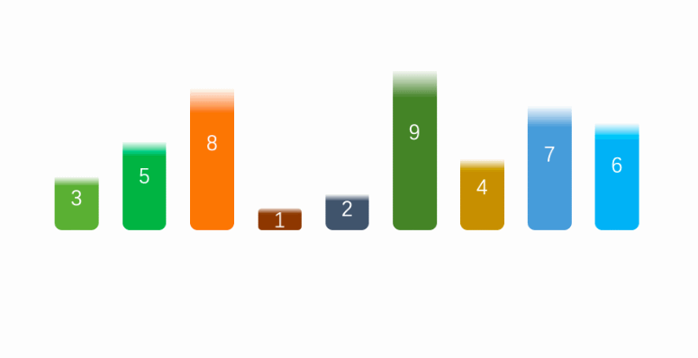

# 排序算法

- 排序算法有很多：冒泡排序/选择排序/插入排序/归并排序/计数排序/基数排序/希尔排序/堆排序/桶排序
- 简单排序：冒泡排序，选择排序，插入排序
- 高级排序：希尔排序，快速排序

## 冒泡排序

1. 对未排序的各元素从头到尾依次比较相邻的两个元素的大小关系
2. 如果左边大，两个交换
3. 向右移动，再次比较
4. 当比较到最后的时候，最大的一定在最右边
5. 重新从最左端开始比较,这次比较到倒数第二个

:::tip 算法效率

1 + 2 + 3 + 4 + ... + n = N\*(N-1) / 2

- 保留最高项 N² / 2
- 去除常量 N²
- 算法效率最终为 N²

:::

## 选择排序

改进了冒泡排序，将**交换次数**O(N²)减少到了 O(N)，但是**比较次数**还是 O(N²)

- 选择第一个索引，然后和后面的元素依次比较
- 如果后面小于这个索引对应的数量，索引重新赋值
- 一轮结束，确定最小的位置
- 同样的方法继续比较
- 第一轮找到最小的，第二轮找到第二小的，第三轮找到第三小的，直到最后

:::tip 算法效率

1 + 2 + 3 + 4 + ... + n = N\*(N-1) / 2

- 保留最高项 N² / 2
- 去除常量 N²
- 算法效率最终为 N²

:::

## 插入排序

- 从第一个元素开始，这个元素被认为是已经排序
- 取出下一个元素，在已经排序的元素中从后向前扫描
- 如果这个元素大于新元素，将元素移到下一个位置
- 重复上一步骤，直到找到已排序的元素小于等于新元素的位置
- 将新元素插入，重复上面的步骤

:::tip 算法效率

1 + 2 + 3 + 4 + ... + n = N\*(N-1) / 2

- 根据平均比较次数和复制次数为其他排序的一半，N\*(N-1) / 4
- 保留最高项 N² / 2
- 去除常量 N²
- 算法效率最终为 N²
- 效率比选择排序和冒泡排序高

:::

## 希尔排序

在插入排序的基础上，进行改进

- 给数据分组，先让间隔为 5，并且进行排序
- 排序后的新序列，可以让自己离正确位置更进一步
- 然后让间隔为 3 进行排序
- 重复操作
- 最后间隔为 1，进行插入排序

- Hibbard 增量：2ⁿ - 1
- Sedgewick 增量：94ⁿ - 9\*2ⁿ + 1 或者 4ⁿ-32ⁿ + 1

## 快速排序

:::tip 提示
面试的时候，首选快速排序
:::

所有排序中，基本是最快的，他是冒泡排序的升级版

- 找一个中位值作为枢纽
- 设置左右两个指针，判断左边是否比枢纽大，右边是否比枢纽小
- 规则成立就进行互换
- 继续判断，直到两者重叠，将枢纽和左边指针互换
- 继续找当前左边和右边枢纽递归调用

## 封装

@[code](./ArrayList.js)
