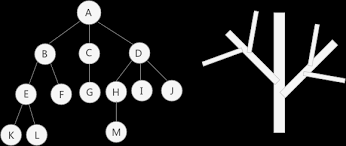
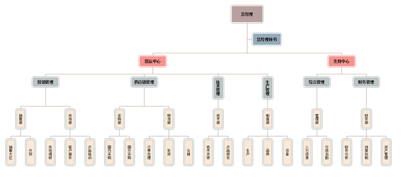
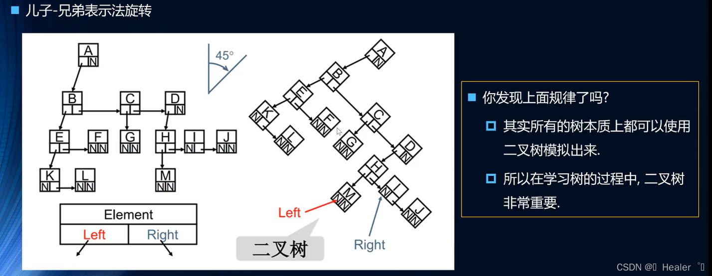

# 树(TREE)

## 什么是树



- 树通常有一个根，连接根的是树干
- 树干到上面之后会分叉成树枝，树枝会分叉成更小的树枝
- 树枝的最后是叶子

## 树结构认识

生活中很多树结构应用

如架构图


## 树结构的优点

- 空间利用率高
- 有序，可以快速查找到最值

## 树结构的术语

n>=0 个节点构成有限集合

- 空树： 当 n=0，称为**空树**
- 根节点： 对于任何一个非空树，根节点（root） 用**r**表示
- 子树： 其余节点可分为 m（m>0）个互不相交的有限集 T1,T2,...,每个集合本身都是一个树，称其为子树
- 节点的度：节点的子树个数
- 树的度(Degree)：树所有节点最大的度
- 叶节点(Leaf)：没有子树的节点
- 父节点(Parent)：有子树的节点是其子树的根节点的父节点
- 子节点(Child)：父节点的子节点
- 兄弟节点(Sibling)：具有同一个父节点的彼此节点都是兄弟节点
- 节点层次(Level)：规定根节点在 1 层，其他任意节点都是其父节点的层数加 1
- 树的深度(Depth)：树中所有节点中的最大层次是这棵树的深度
- 路径和路径长度：从节点 n1 到 nk 的路径为一个节点序列。路径所包含边的个数为路径的长度
## 二叉树的结构表示
```js
Node {
  this.data = data
  this.leftChild = B
  this.sibling = C
}
```
如果使用儿子-兄弟表示法旋转45度，形成二叉树

