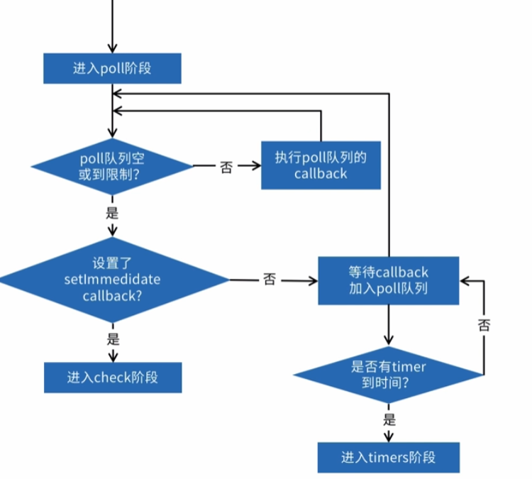

# 事件循环 eventLoop

下面这段代码执行什么呢？，答案是 1,4,3,2

```js
console.log(1)
setTimeout(function () {
  console.log(2)
}, 0)
Promise.resolve().then(function () {
  console.log(3)
})
console.log(4)
```

## 宏任务（Task）

- script
- setTimeout/setInterval
- setImmediate
- I/O
- UI render

##　微任务（microtask）

- promise
- Object.observe 监听对象变化
- MutationObserve 监听 dom 结构变化
- possMessage window 对象之间通信的方法

## 浏览器里的 eventloop

## nodejs 的 eventloop

:::tip 注意
nextTick 不属于 nodejs 的 eventloop，一旦设置了这个，nodejs 会先停止 eventloop，执行 nextTick 再开启 eventloop
:::

执行阶段

1. timer：执行 timer 的阶段
2. padding callbacks：系统操作的回调
3. idle，pepare 内部使用
4. poll：等待新 I/O 事件
5. check：执行 setImmediate 回调
6. close callbacks 内部使用



## 小试牛刀

<CodeGroup>
<CodeGroupItem title="第1题">

```js
console.log('1')
setTimeout(function () {
  console.log('2')
}, 0)
Promise.resolve().then(function () {
  console.log('3')
})
console.log('4')

console.log('start')

setTimeout(() => {
  console.log('setTimeout')
  new Promise(resolve => {
    console.log('promise inner1')
    resolve()
  }).then(() => {
    console.log('promise then1')
  })
}, 0)

new Promise(resolve => {
  console.log('promise inner2')
  resolve()
}).then(() => {
  console.log('promise then2')
})
```

</CodeGroupItem>
<CodeGroupItem title="第2题">

```js
async function async1() {
  console.log('async1 start')
  await async2()
  console.log('async1 end')
}
async function async2() {
  return Promise.resolve().then(res => {
    console.log('async2 promise')
  })
}
console.log('start')
setTimeout(function () {
  console.log('setTimeout')
}, 0)
async1()
new Promise(function (resolve) {
  console.log('Promise1')
  resolve()
}).then(function () {
  console.log('promise2')
})
// start,async1 start,Promise1,async2 promise,promise2,async1 end,setTimeout
```

</CodeGroupItem>
<CodeGroupItem title="第3题">

```js
setTimeout(_ => {
  console.log('setTimeout')
}, 0)
setImmediate(_ => {
  console.log('setImmediate')
})
```

</CodeGroupItem>
<CodeGroupItem title="第4题">

```js
const fs = require('fs')
fs.readFile(__filename, _ => {
  setTimeout(_ => {
    console.log('setTimeout')
  }, 0)
  setImmediate(_ => {
    console.log('setImmediate')
  })
})
```

</CodeGroupItem>
<CodeGroupItem title="第5题">

```js
const fs = require('fs')
fs.readFile(__filename, _ => {
  setTimeout(_ => {
    console.log('setTimeout')
  }, 0)
  setImmediate(_ => {
    console.log('setImmediate')
    process.nextTick(_ => {
      console.log('nextTick2')
    })
  })
  process.nextTick(_ => {
    console.log('nextTick1')
  })
})
```

</CodeGroupItem>
<CodeGroupItem title="第6题">

```js
const fs = require('fs')

function someAsyncOperation(callback) {
  fs.readFile(__dirname, callback)
}

const timeoutScheduled = Date.now()

setTimeout(() => {
  const delay = Date.now() - timeoutScheduled
  console.log(`${delay}ms have passed since I was scheduled`)
}, 100)

someAsyncOperation(() => {
  const startCallback = Date.now()
  while (Date.now() - startCallback < 200) {
    // do nothing
  }
})
```

</CodeGroupItem>
</CodeGroup>

## setInterval 和 requestAnimationFrame

requestAnimationFrame 和 setInterval 都可以实现动画，但是 setInterval 会在页面不可见的时候继续执行动画，requestAnimationFrame 会在不可见的时候不执行
