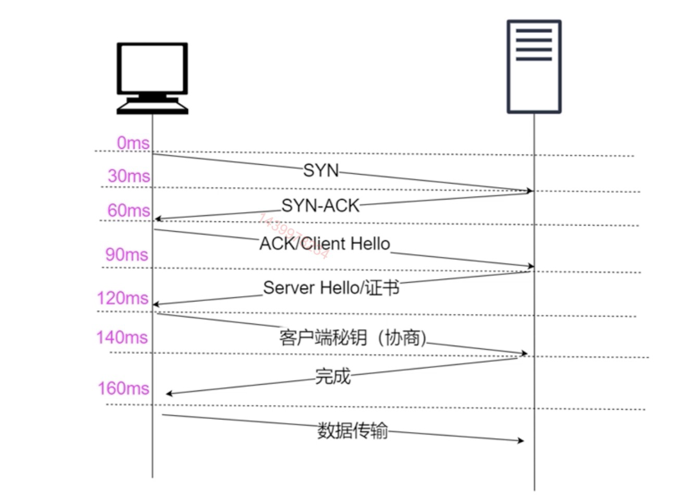

## 对称加密和非对称加密

加密是指将明文信息变成不可读的密文信息，只有解密的对象，才能将密文还原成加密前的内容

- 对称加密：加密和解密的密钥相同

- 非对称加密：加密和解密的密钥不同
  - 创建者创建一个密钥对（公钥和私钥）
  - 公钥加密只能私钥解密
  - 私钥加密只能公钥解密
  - 私钥保留，公钥对外公开
    :::tip 什么场景需要非对称
    作为用户发布方，使用公钥。用户提交订单需要公钥加密，服务器使用私钥解密
    :::

## 解决信任问题

可能被 DNS 劫持，访问的网页可能被黑客劫持，重定向了一个仿造的网页

- 机器上预装根证书
- 根证书使用私钥签名阿里巴巴的签名
- 通过公钥解密阿里巴巴的签名
- 如果两个相等就是正确的

## 常见算法

- 1970 IMB 对称加密（DEC）<Badge text="可暴力破解"/>
- 2001 美国 对称加密（AES）<Badge text="可旁攻攻击"/> 还原算法，反推密文
- 1977 RSA 非对称加密算法

## HTTPS 工作原理

