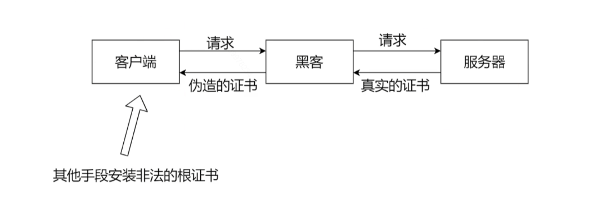

## 阻断服务攻击（DoS）

- 阻断服务攻击，想办法将目标的网络资源用尽
- 分布式阻断服务攻击
- 宽带消耗型（消耗带宽）
- 资源消耗型（消耗计算资源）

:::tip 解决

- 防火墙
- 交换机
- 流量清洗

:::

## 地址解析欺骗（ARP 攻击）

## 跨站脚本攻击（XSS）

将跨站脚本注入到被攻击的网页上，用户打开网页就会执行跨站脚本

## SQL 注入

`';update user set money = 999999 where id = 10025;//`
在用户提交表单的时候，修改 sql，修改了金额

## 跨站请求伪造(CSRF)

最早期 get 和 post 混用
`转账<a href='xxx.com?money=41100&to=123'>点击下载有趣图片</a>`

## 中间人攻击（https）

伪造证书，安装非法证书
这是 https 安装抓包的原理

